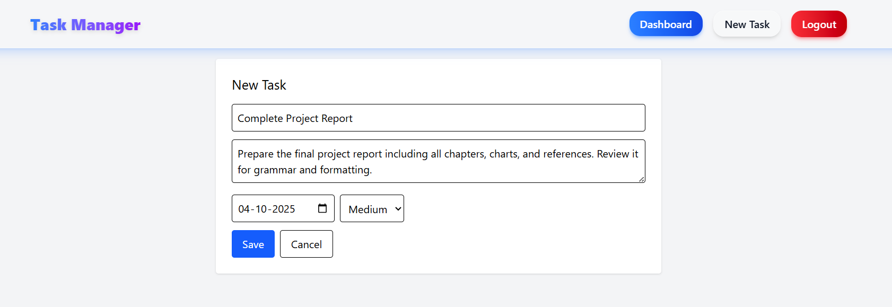
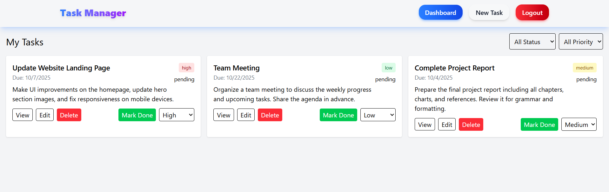
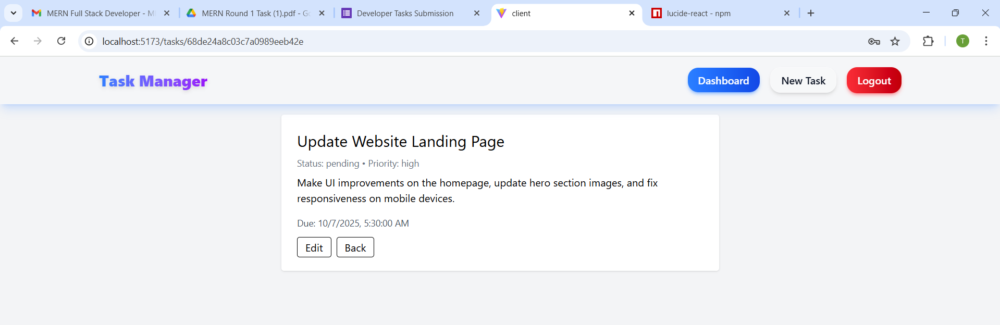
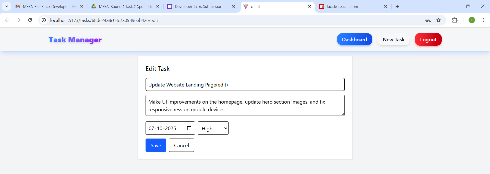
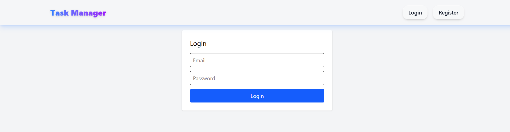

# 📝 Simple Task Management System

A **web-based Task Management System** that helps users manage tasks efficiently with features like creation, editing, deletion, prioritization, and user authentication. The system comes with a **responsive frontend** and a **secure backend**.

---

## 🚀 Features

### ✅ 1. Task Creation
- Create new tasks using a form.  
- Each task includes:
  - **Title**
  - **Description**
  - **Due Date**  
- Tasks can be added to **priority lists** (Low, Medium, High).  


---

### 📋 2. Task List
- Displays all tasks in a **paginated list**.  
- Each task shows:
  - **Title**
  - **Due Date**
  - **Status** (Pending / Completed)  
- Uses **AJAX** for fast, smooth updates without page reloads.  


---

### 🔍 3. Task Details
- Detailed view for each task with:
  - Full **Description**
  - **Due Date**
  - **Priority**
  - **Status**  


---

### ✏️ 4. Task Editing
- Update existing tasks easily.  
- Editable fields:
  - **Title**
  - **Description**
  - **Due Date**
  - **Priority**
  - **Status**  


---

### 🗑️ 5. Task Deletion
- Delete tasks with a **confirmation dialogue** to prevent accidental removal.  

---

### 🔄 6. Task Status Update
- Mark tasks as **Completed** or update their **status dynamically**.  

---

### 🔐 7. User Authentication
- Ensures only **authorized users** can:
  - Create, view, edit, delete tasks
  - Add/remove users
  - Assign tasks  
- Logged-in users can only view their **assigned tasks**.  


---

### ⚡ 8. Priority Management
- Move tasks between **priority lists**.  
- Priority levels determine importance and visual representation.  

---

### 🎨 9. Visual Representation
- Color-coded priority system:
  - **High:** 🔴 Red
  - **Medium:** 🟡 Yellow
  - **Low:** 🟢 Green  

---

## 🛠 Tech Stack

- **Frontend:** React, Vite, TailwindCSS, Framer Motion  
- **Backend:** Node.js, Express.js, MongoDB  
- **Authentication:** JWT (or similar secure method)  
- **Others:** Axios / Fetch API for AJAX requests  

---

## ⚙️ Getting Started

### 1. Clone the repository
```bash
git clone https://github.com/tushar6263/Simple-Task-Management-System.git

---
2. Install dependencies for frontend and backend:
   ```bash
   cd client
   npm install
   cd server
   npm install
--- 

3. Run the development servers:
```bash
# Backend
Nodemon server.js(5000)

# Frontend
npm run dev

Access the app in your browser at http://localhost:5173 (or the port provided by Vite).
---

### License

This project is open-source and available for modification and personal use.
---

